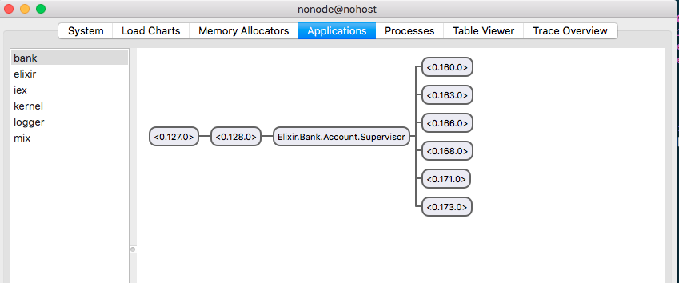
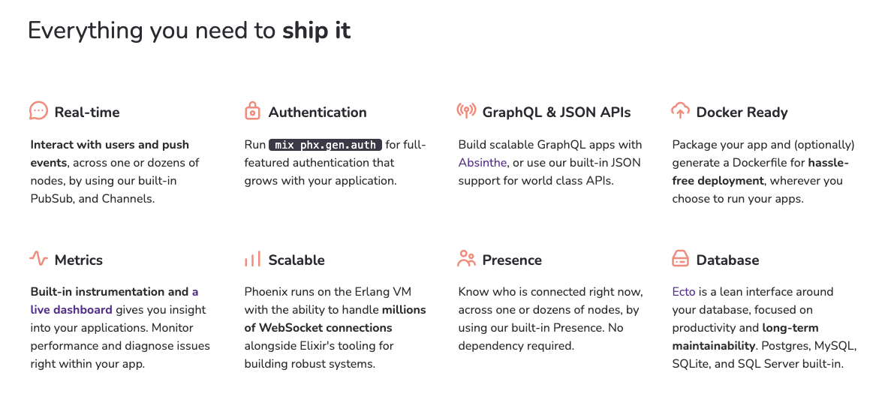
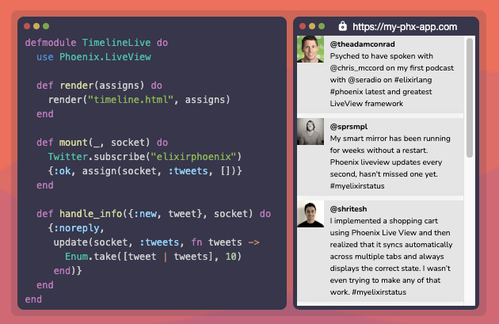
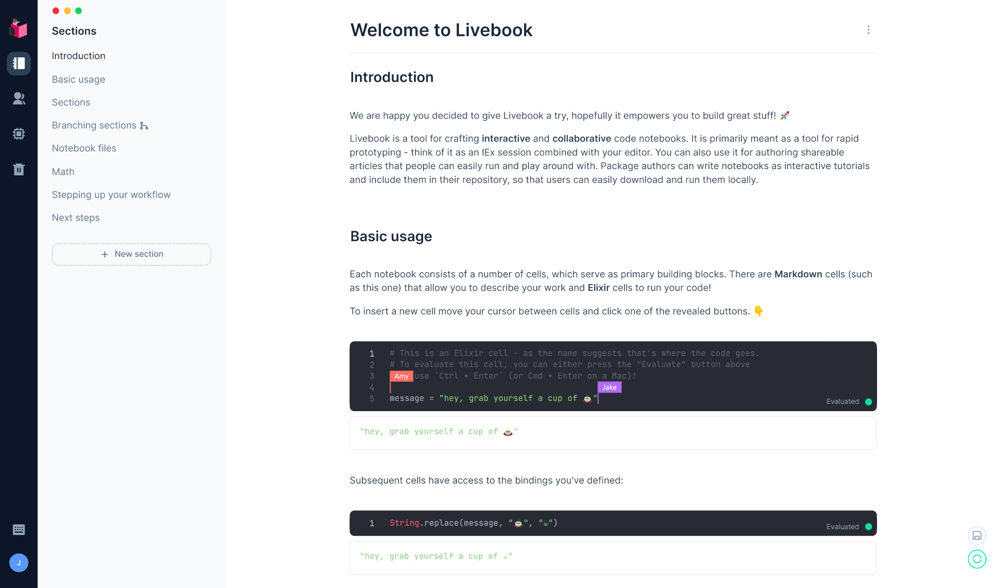
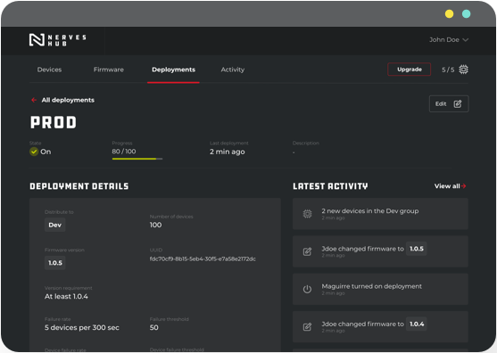

# Learning Elixir in 2023
Elixir Study Group

---

# Hello!

[Gabriel Alves](https://github.com/goalves)

---

# What is Elixir?

<style scoped>
  img {background-color: white!important;}
</style>


---

- Elixir is as a dynamic, functional programming language
- Version 1.0 released on Sep/2014
- Runs on the Erlang Virtual Machine (BEAM)
- Emphasizes scalability, fault-tolerance, and concurrency features

---

# Why Learn Elixir?
- [Second most loved language on SO survey from 2022](https://survey.stackoverflow.co/2022/#most-loved-dreaded-and-wanted-language-love-dread). (#1 was Rust 🦀)
  - Really good engineering experience, solid community and frameworks for almost everything
- Amongst the top paying technologies (Cobol $)
- Challenge yourself
- Maybe I can convince you during this presentation!

---

```elixir
defmodule User do
  defstruct [:name, :age]

  def new(name, age) do
    %User{name: name, age: age}
  end

  def greet(%User{name: name}) do
    "Hello, #{name}!"
  end

  def adult?(%User{age: age}) when age >= 18 do
    true
  end

  def adult?(%User{age: age}) do
    false
  end
end
```

---

# Who uses it?

---

- Pinterest: [Half the servers, 10 times less code](https://venturebeat.com/2015/12/18/pinterest-elixir/)
- Discord: [11 Million Concurrent Users](https://elixir-lang.org/blog/2020/10/08/real-time-communication-at-scale-with-elixir-at-discord/)
- Bleacher Report: [From 150 servers to just 5](https://www.techworld.com/apps-wearables/how-elixir-helped-bleacher-report-handle-8x-more-traffic-3653957/)
- Others: [PepsiCo eCommerce](https://elixir-lang.org/blog/2021/04/02/marketing-and-sales-intelligence-with-elixir-at-pepsico/), bet365, Nintendo, Postmates, Vox Media, [Heroku](https://elixir-lang.org/blog/2020/09/24/paas-with-elixir-at-Heroku/)

---

# Core Features

---

## Pattern Matching

```elixir
defmodule Fibonacci do
  def fib(0), do: 0
  def fib(1), do: 1
  def fib(n), do: fib(n - 1) + fib(n - 2)
end

Fibonacci.fib(5) |> IO.puts() # Output: 5
Fibonacci.fib(10) |> IO.puts() # Output: 55
```

---

## Concurrency and Parallelism

<style scoped>
  img {
    background-color: white!important;
    width: 100%;
  }
</style>


---

## Fault-Tolerance and Self-Healing
- "Let it crash" **as long as the user doesn't notice**
- Planned initially for working on network and telecom switches that are unreliable
- Built with resiliency and observability in mind, easy to scale and grow

---

## Example Application

```elixir
defmodule MyApp do
  use Application

  def start(_type, _args) do
    children = [
      {MyApp.Process, ["Worker 1"]},
      {MyApp.Process, ["Worker 2"]}
    ]

    opts = [strategy: :one_for_one, name: MyApp.Supervisor]
    Supervisor.start_link(children, opts)
  end
end
```
---

##### Example Process

```elixir
defmodule MyApp.Process do
  use GenServer

  def start_link([name]) do
    GenServer.start_link(__MODULE__, [], name: name)
  end

  def init(name) do
    IO.puts("#{name} started")
    {:ok, []}
  end

  def handle_call({:process_message, message}, _from, state) do
    IO.puts("Processing message: #{inspect(message)}")
    {:reply, :ok, state}
  end

  def handle_cast({:send_message, message}, state) do
    IO.puts("Sending message: #{inspect(message)}")
    {:noreply, state}
  end
end
```

---

Everything is traceable, even remotely

<style scoped>
  img {
    background-color: white!important;
    width: 100%;
  }
</style>



---

Now imagine having millions of processes
in the same machine

---

Or in different machines throughout the world!

---

## Integration with other Languages

- Through Ports, byte-oriented interface
- Running code inside of the virtual machine
  - [what language could we use here?](https://github.com/rusterlium/rustler)

---

# Summary

- Have the core premises for reliability, observability, and communication **in the language**
- Functional paradigm
- Actor system for sending messages
- Good interoperability

---

# Why is this useful or why should I care?

---

Serves as a solid foundation to
build **everything** you can imagine

---

Let's dive in some examples for each area :)

---

# Web Development


---

- Productivity
<!--
  - Code generators.
  - There were really almost no scenario where I have used a library and thought that "hey this is weird or not what I expected"
-->
- Testing and Documentation
<!-- Builtin testing with ExUnit, documentation with ExDoc and Livebook. -->
- Scalability, Performance, Reliability
<!-- Because it relies on OTP, we get EVERYTHING from them for free -->

---

<style scoped>
  img {
    background-color: white!important;
    width:100%;
    margin:auto;
  }
</style>



---

# Backend

---

```elixir
defmodule ApplicationWeb.UserController do
  use ApplicationWeb, :controller

  alias Application.{Accounts, Validator}
  alias Application.Accounts.User

  action_fallback ApplicationWeb.FallbackController

  def create(conn, %{"user" => user_params}) do
    with {:ok, %User{} = user} <- Accounts.create_user(user_params) do
      conn
      |> put_status(:created)
      |> put_resp_header("location", Routes.user_path(conn, :show, user))
      |> render("show.json", user: user)
    end
  end

  def show(conn, %{"id" => id}) do
    with :ok <- Validator.validate_uuid(id),
         {:ok, %User{} = user} <- Accounts.get_user(id),
         do: render(conn, "show.json", user: user)
  end
end
```

---

## Using Ecto the ORM

```elixir
defmodule MyApp.Post do
  use Ecto.Schema

  schema "posts" do
    field :title, :string
    field :content, :string
    field :published_at, :datetime

    timestamps()
  end
end
```

---

#### Querying

```elixir
defmodule MyApp.Posts do
  import Ecto.Query

  def create_post(attrs \\ %{}) do
    MyApp.Repo.insert(%MyApp.Post{attrs | published_at: DateTime.utc_now()})
  end

  # Only does one query
  def get_post(id) do
    MyApp.Post |> MyApp.Repo.with(:user) |> MyApp.Repo.get(id)
  end

  # Querying with a composable piped syntax
  def list_posts do
    from(p in MyApp.Post)
    |> where([p], not is_nil(p.published_at))
    |> order_by([p], [desc: p.published_at])
    |> MyApp.Repo.all()
  end
end
```

---

## Manages migrations through files
(no magic)

```elixir
defmodule MyApp.Repo.Migrations.CreatePosts do
  use Ecto.Migration

  def change do
    create table(:posts) do
      add :title, :string
      add :content, :string
      add :published_at, :utc_datetime

      timestamps()
    end
  end
end
```

---

# Phoenix LiveView
And how to write frontend without Javascript

---

- Server-side rendering approach
- You almost don't need to write JS
- Works by calling/receiving data from the backend and updating specific HTML elements in the UI
- No "API"s to create, no integration, just update server state and the frontend is updated

---

```elixir
defmodule MyAppWeb.Live.Counter do
  use Phoenix.LiveView

  def mount(_params, _session, socket) do
    {:ok, assign(socket, count: 0)}
  end

  def handle_event("increment", _, %{assigns: %{count: count}} = socket) do
    {:noreply, assign(socket, count: count + 1)}
  end

  def render(assigns) do
    ~L"""
    <div>
      <h1>Counter: <%= @count %></h1>
      <button phx-click="increment">Increment</button>
    </div>
    """
  end
end
```
---

<style scoped>
  img {width:90%;}
</style>



---

<style scoped>
  img {width:80%;}
</style>


---

## Other examples

- [Writing a distributed twitter clone in 15 minutes](https://www.youtube.com/watch?v=MZvmYaFkNJI)
- [TodoTrek](https://github.com/chrismccord/todo_trek) [Video](https://www.phoenixframework.org/images/blog/todo_trek.mp4)

---

# Livebook: Interactive Coding
Glueing everything we've seen so far

---

<style scoped>
  img {width:80%;}
</style>



---

- It works remotely or locally
- Similar to Python Notebooks
- Handles dependencies inside of the running instance, package manager is included!
- Small demo if we have time!

---

# Machine Learning with Nx and Axon
Running Elixir on GPUs!

---

Numerical Elixir is an effort started in 2021 to bring the power of numerical computing to Elixir (and vice-versa).

---

- Compiles Elixir code to Google's XLA
- Is generally glued on top of Livebook to provide Notebooks for machine learning
- Has libraries for visualizing, training, running and deploying models.
- [Locally evaluating Dataframes](https://livebook.dev/run/?url=https%3A%2F%2Fgist.githubusercontent.com%2Fhugobarauna%2Fcd509c9ea429c3e6a664b64e34a6c31c%2Fraw%2Fde7ef09070178792a1439a8c1ddcbce3da2c10ff%2Fdata_wrangling_with_explorer.livemd)

---

```elixir
model =
  Axon.input({nil, 30})
  |> Axon.dense(256)
  |> Axon.relu()
  |> Axon.dense(256)
  |> Axon.relu()
  |> Axon.dropout(rate: 0.3)
  |> Axon.dense(256)
  |> Axon.relu()
  |> Axon.dropout(rate: 0.3)
  |> Axon.dense(1)
  |> Axon.sigmoid()

# ...

model_state =
  model
  |> Axon.Loop.trainer(loss, optimizer)
  |> Axon.Loop.metric(:precision)
  |> Axon.Loop.metric(:recall)
  |> Axon.Loop.run(batched_train, epochs: 30, compiler: EXLA)
```

---

# Embedded Systems with Nerves
What? Are you serious?

---

“...is the open-source platform and infrastructure you need to build, deploy, and securely manage your fleet of IoT devices at speed and scale”

---

- [Nerves HexDocs](https://hexdocs.pm/nerves/api-reference.html)
- I have done a presentation on it a few years ago
- Built August software from scratch, being able to monitor and update it remotely in around 8 hours

---

# Features

- Integrates directly with security chips for encryption
- Remote updates with delta changes
- You can even run a Livebook remotely and try code out
- As usual, you have everything from OTP available (if you want)

---

<style scoped>
  img {width:80%;}
</style>



---

# Q&A and Closing

Thank you!
